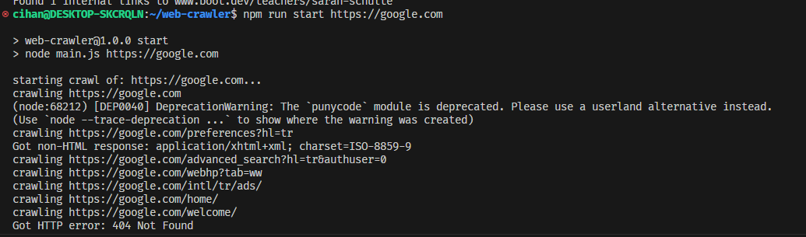

# web-crawler

## Description

This is a simple web crawler that crawls a website and returns a list of all the links on that website. It is written in Javascript and uses Node.js.

## Installation

1. Clone the repository
2. Run `npm install` to install the dependencies

## Usage

1. Run `node run start domain` to start the web crawler
2. Replace `domain` with the domain you want to crawl

## License

